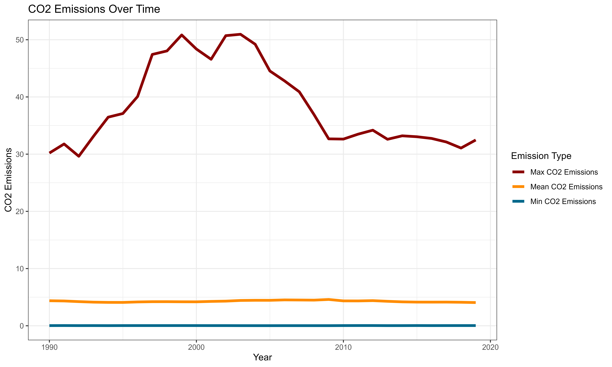
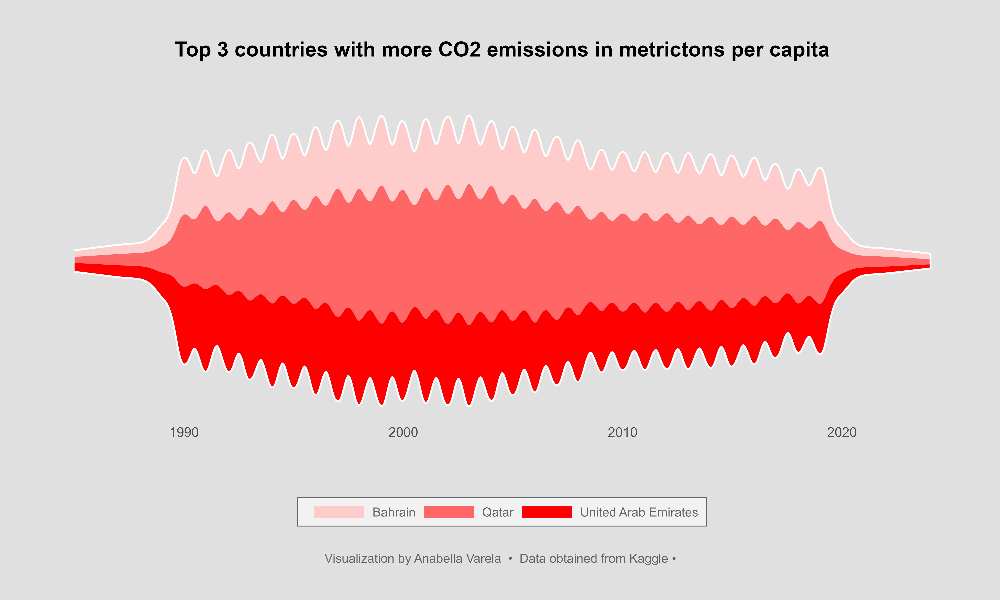
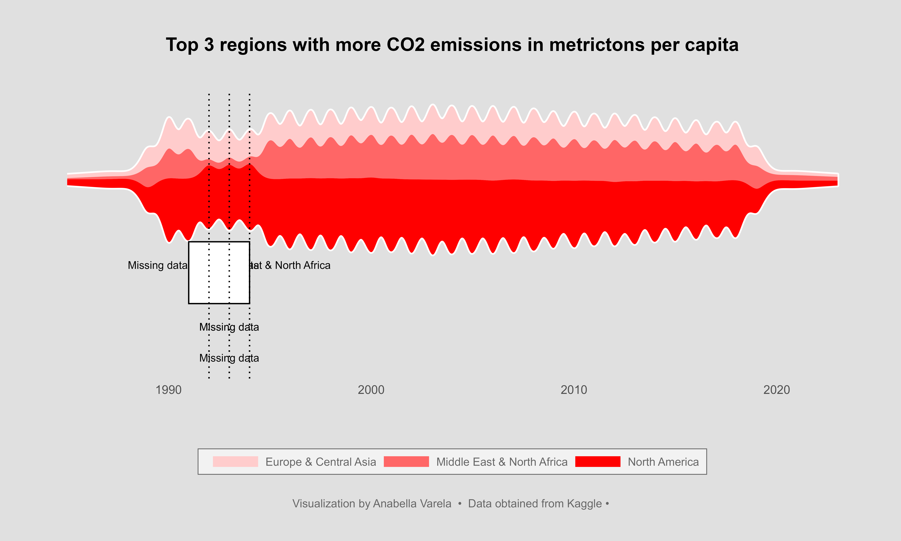

# Exploratory analysis and Data Visualization with R
## CO2 emissions per capita
  CO2 emissions per capita refer to the amount of carbon dioxide (CO2) emitted by a country or region per person in a given year. It is a critical metric used to assess the environmental impact of a country's activities and its contribution to global greenhouse gas emissions. 

## About Dataset
 I downloaded the dataset from [Kaggle](https://www.kaggle.com/datasets/koustavghosh149/co2-emission-around-the-world).  This Dataset consists CO2 emissions in metricton per capita of every country around the world. The datas are from 1990 to 2019. Coutries regions are included. Data was collected from world data bank. https://data.worldbank.org/indicator/EN.ATM.CO2E.PC

## Task
The main objective of this project is to identify the countries and regions with the highest CO2 emissions and analyze the trends over time.

## Tools
For this analysis, I utilized the R programming language for data cleaning, data analysis, and data visualization. In particular, I used the ggplot2 package to create a stream graph (also sometimes called a "Theme River"). A stream graph is like a stacked area chart but oriented around a central line, which provides an effective way to visualize the changes in CO2 emissions across different regions over the years.

## Key Insights
- The global mean emission has decreased from 4.38 metric tons per capita in 1990 to 4.06 metric tons per capita in 2019.
- While the mean and minimum emission values have remained relatively stable over the years, the maximum values experienced a peak in the year 2000.

- There are significant differences in CO2 emissions among world regions and countries.
- Industrialized countries tend to have higher per capita emissions than less industrialized nations.
- The countries with the highest CO2 emissions are primarily located in the Middle East & North Africa region, followed by North America and Europe.

- When visualizing the top 3 countries with more CO2 emissions there is a reduction of the emissions from 2000. 

- However, a clear trend is not evident when analyzing the top 3 regions with the highest CO2 emissions. 
