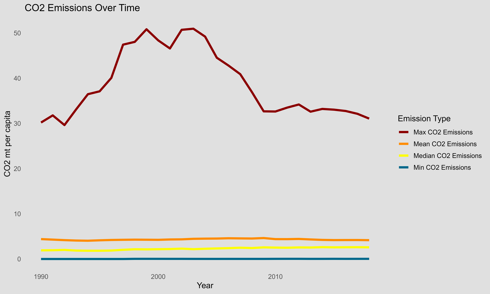
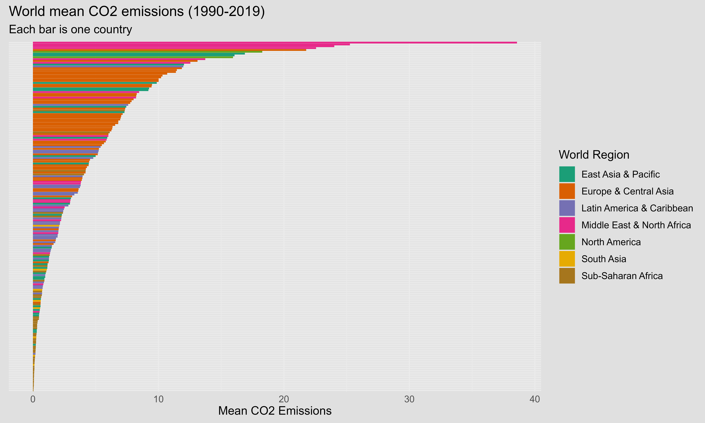
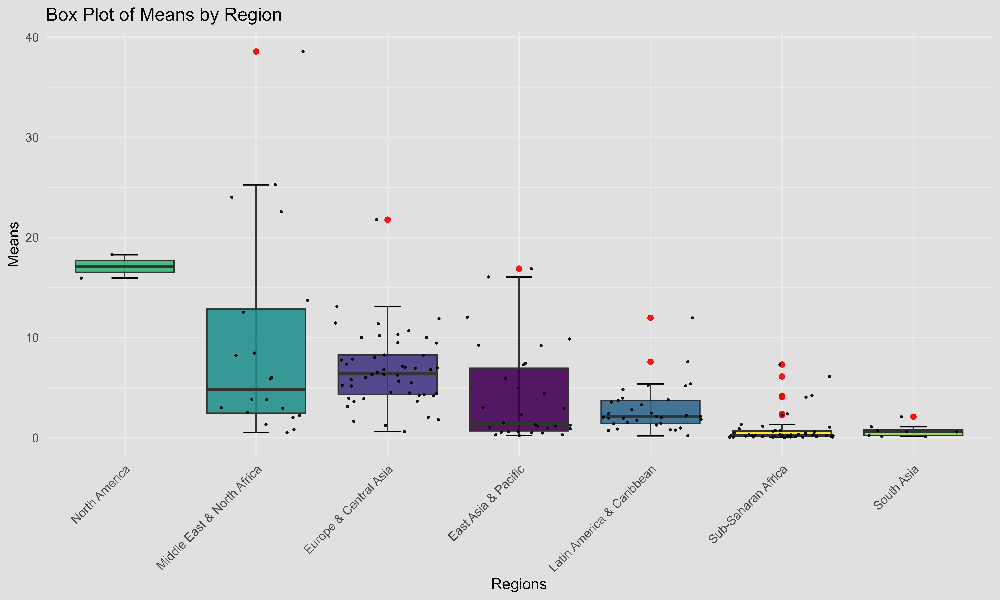
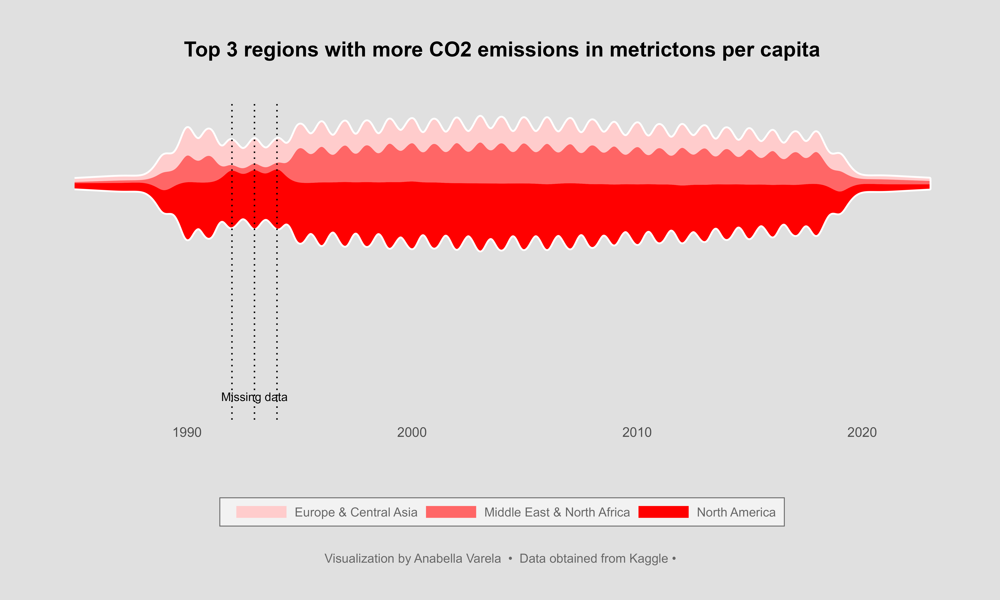

# Exploratory analysis and Data Visualization with R
## Table of Contents

- [Introduction](#introduction)
- [Dataset](#dataset)
- [Task](#task)
- [Tools](#tools)
- [Key Insights](#insights)

## Introduction
  CO2 emissions per capita refer to the amount of carbon dioxide (CO2) emitted by a country or region per person in a given year. It is a critical metric used to assess the environmental impact of a country's activities and its contribution to global greenhouse gas emissions. 

## Dataset
 I downloaded the dataset from [Kaggle](https://www.kaggle.com/datasets/koustavghosh149/co2-emission-around-the-world).  This Dataset consists CO2 emissions in metricton per capita of every country around the world. The datas are from 1990 to 2019. Coutries regions are included. Data was collected from world data bank. https://data.worldbank.org/indicator/EN.ATM.CO2E.PC

## Task
The main objective of this project is to identify the countries and regions with the highest CO2 emissions and analyze the trends over time.

## Tools
During the analysis, I employed the R programming language. I made use of several libraries, including ggplot2, ggtext, agricolae, and tidyr, among others. These libraries played a pivotal role in facilitating data cleaning, analysis, and visualization, leading to insightful findings.

I created five figures that portrayed the trends in CO2 emissions across various regions over the years. One of the visualizations was a stream graph, a refined version of a stacked area chart, pivoted around a central line. 

## Insights
-The analysis reveals a decline in the global mean CO2 emissions per capita from 4.38 metric tons in 1990 to 4.06 metric tons in 2019. 
- Over the years, the mean and minimum emission values have displayed relative stability, while the maximum values experienced a peak in 2000 (see Figure 1).

- Significant disparities in CO2 emissions are evident among world regions and countries. Notably, the Middle East & North Africa region exhibits the highest CO2 emissions, followed by North America and Europe. Conversely, South Asia and Sub-Saharan Africa have the lowest emissions (see Figure 2).

- Focusing on the Middle East & North Africa region, specific attention should be directed towards Qatar, United Arab Emirates, Kuwait, and Bahrain to substantially reduce the emissions of the region (see Figure 3).

-Although the top three countries with the highest CO2 emissions demonstrated a decline in emissions since 2000 (see Figure 4), the trends across the top three regions are less apparent ( Figure 5).

