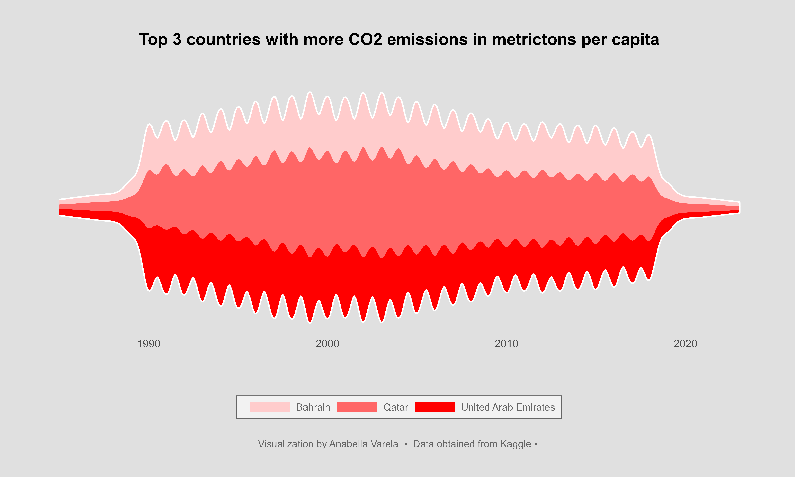

# Exploratory analysis and Data Visualization with R
## Table of Contents

- [Introduction](#introduction)
- [Dataset](#dataset)
- [Task](#task)
- [Tools](#tools)
- [Key Insights](#insights)

## Introduction
  CO2 emissions per capita refer to the amount of carbon dioxide (CO2) emitted by a country or region per person in a given year. It is a critical metric used to assess the environmental impact of a country's activities and its contribution to global greenhouse gas emissions. 

## Dataset
 I downloaded the dataset from [Kaggle](https://www.kaggle.com/datasets/koustavghosh149/co2-emission-around-the-world).  This Dataset consists CO2 emissions in metricton per capita of every country around the world. The datas are from 1990 to 2019. Coutries regions are included. Data was collected from world data bank. https://data.worldbank.org/indicator/EN.ATM.CO2E.PC

## Task
The main objective of this project is to identify the countries and regions with the highest CO2 emissions and analyze the trends over time.

## Tools
During the analysis, I employed the R programming language. I made use of several libraries, including ggplot2, ggtext, agricolae, and tidyr, among others. These libraries played a pivotal role in facilitating data cleaning, analysis, and visualization, leading to insightful findings.

I created five figures that portrayed the trends in CO2 emissions across various regions over the years. One of the visualizations was a stream graph, a refined version of a stacked area chart, pivoted around a central line. 

## Insights
- The main findings from the EDA can be seen in this [Google slides presentation](https://docs.google.com/presentation/d/1v19GGn3EvbPBqgHEjUh3ap2xgAp8zH9sCHrOyp3j5o4/edit?usp=sharing)
Figures created with this script: 
- Figure 1: line chart

- Figure 2: horizontal bar chart

- Figure 3: Box plot with jittered data points to see the nations that have stood out as significant contributors to elevated regional average emissions.

- Figure 4 and 5: stream graph

